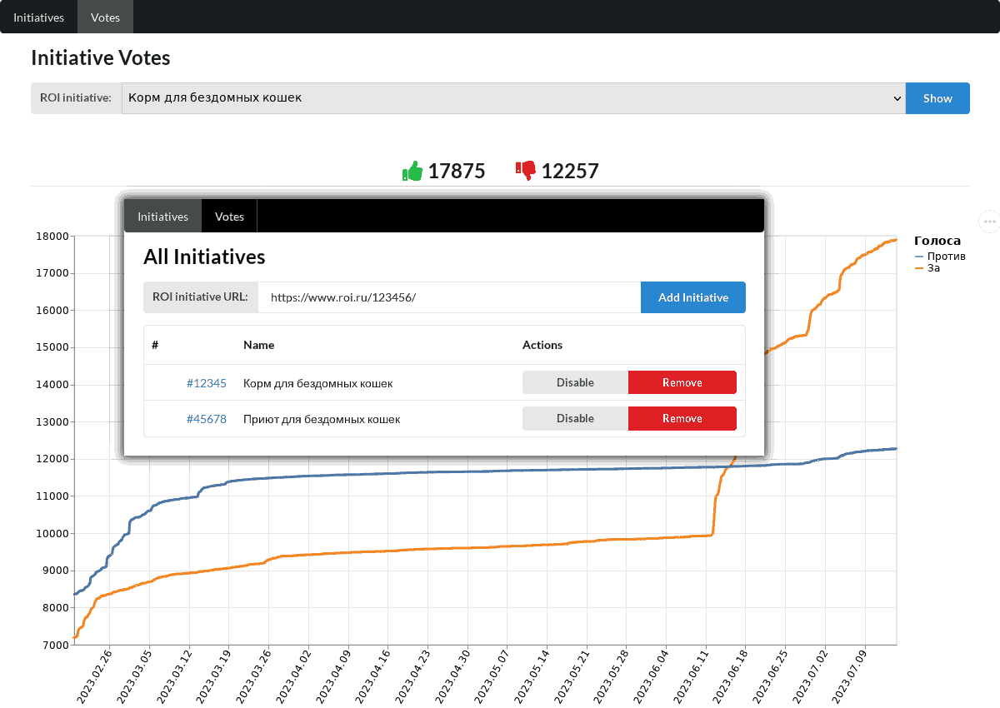

# ROI Parser

Crawler and WEB server to track and manage initiatives on ROI site. Parser periodically scan all initiatives and save
vote count for every initiative.



## Build

To build `roi-parser` from source code use following command:

```sh
cargo build --release
```

To start `roi-parser` with default configuration listening on `localhost:8080` use following command:

```sh
./target/release/roi-parser
```

Local database will be created in file `db.sqlite`. WEB server will be available on [localhost|http://localhost:8080/].

## Command line options

* `-h` (long `--help`) - prints short help;
* `-n` (long `--no-worker`) - do not start background RIO crawler;
* `-V` (long `--version`) - prints version information;
* `-a` (long `--address`) <address> - address to listen on, default: 127.0.0.1;
* `-d` (long `--database`) <database> - path to local SQLite database, default: db.sqlite;
* `-p` (long `--port`) <port> - port to listen on, default: 8080;
* `-q` (long `--query-interval`) <query-interval> - interval between ROI queries in seconds, default: 10;
* `-r` (long `--read-timeout`) <read-timeout> - socket read timeout in seconds, default: 30;
* `-u` (long `--update-interval`) <update-interval> - initiatives update interval in seconds, default: 1800;

## License
[license]: #license

Source code is primarily distributed under the terms of the MIT license. See LICENSE for details.
